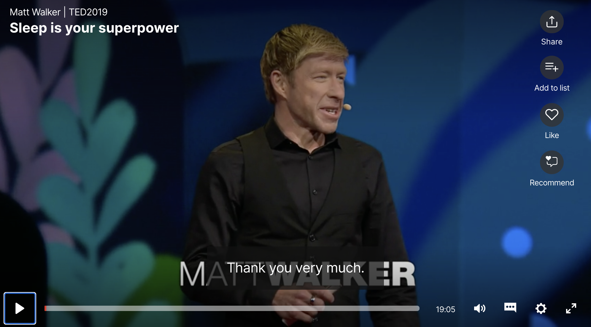
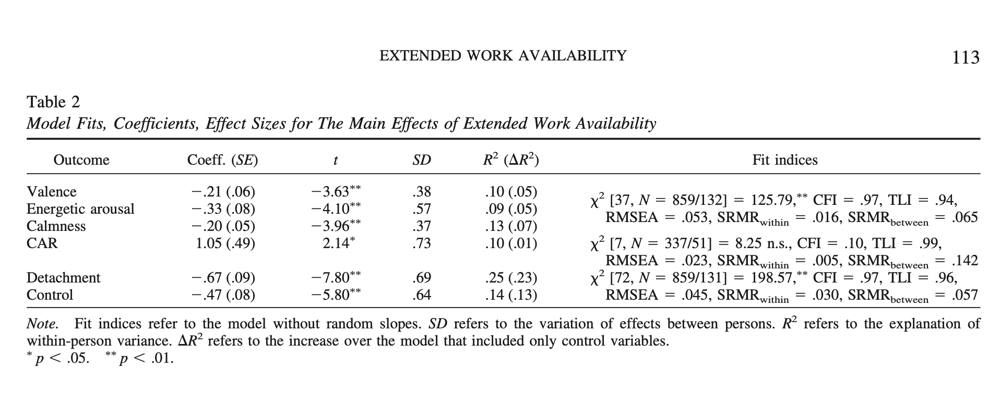
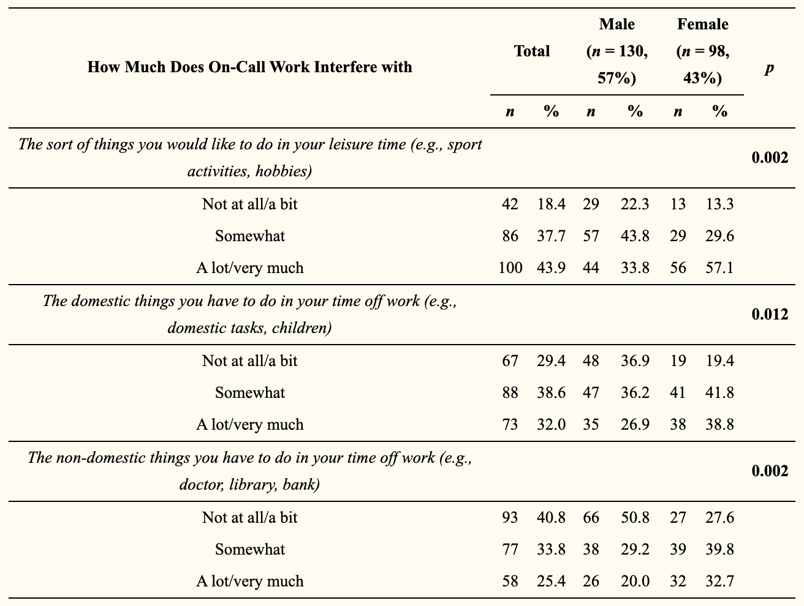
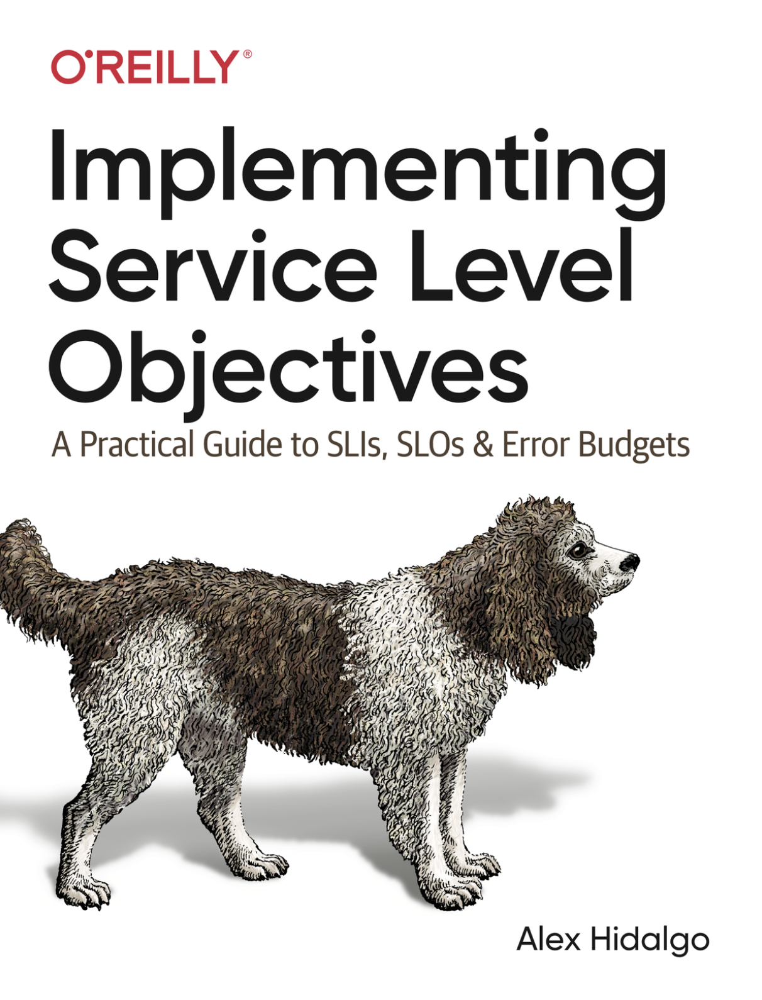
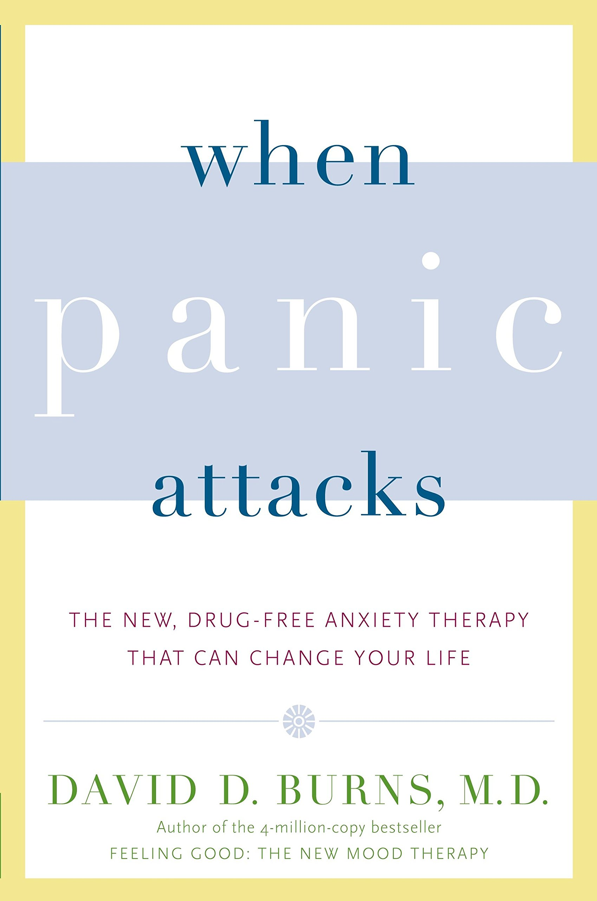

theme: Zurich, 5

# What On-Call Does to Us

Rich Burroughs
Senior Developer Advocate
FireHydrant
@richburroughs

---

# It was 1996

^ Got a call center job at an ISP and got promoted to sysadmin

---

# Here's your pager

^ My boss got me a pager. I was the only sysadmin, and I was suddenly on-call all of the time for a small number of Linux hosts (5-10)

---

# I was stoked

^ I think I was probably excited about this. Suddenly I had some extra responsibility.

---

# Fast forward to 2016

^ Fast forward 20 years. I'd been on-call for most of that time, in rotations of different sizes. Some as small as 3 people, some as big as 10.
^ For a while I was on a team where our boss divided us up by time slots instead of weeks. I was oncall every evening from 7PM to midnight.

---

# My mental health had deteriorated

^ I started having very bad claustrophobia and had panic attacks when I would board airplanes.
^ The first time I had a debate with myself about asking them to let me off of the plane.
^ I was diagnosed with Generalized Anxiety Disorder. I also had episodes of depression where I'd be in bed for a week straight.

---

# I'm not saying all of this was from being on-call

^ Other things were happening in my life that contributed to my anxiety and depression.
^ But I also can't imagine that being on-call for most of 20 years helped.

---

# We all have stories

^ Talk to anyone who has been on-call and they can likely tell you about pain they've felt from it.
^ We talk about these things a lot. I've heard stories from a lot of my peers as well.
^ But this is all anecdotal. We all have biases and we're unreliable narrators of our own lives.

---

# Meanwhile... Science

^ Meanwhile there are psychologists who have been studying the effect of being oncall for decades. 
^ Sometimes as people in tech we think we know it all and ignore the work of people in other disciplines.
^ We should learn from them instad.

---

# So let's look at some studies

^ I'm going to share with you a few scientific studies about being on-call
^ Psychological studies are a great way to identify counterintuitive things, or areas we are blind to due to our biases

---

# There are some big caveats

- I am not a mental health practitioner or expert
- I've looked into a small number of studies
- These are individual studies so take them with a grain of salt

^ I'm not an expert
^ I've looked into a small number of studies
^ An individual study is just one data point. They need to be duplicated.

---

# But first, let's talk about sleep

^ Before we get into the oncall studies, let's talk for a moment about sleep

---

^ There was a great Ted talk from 2019 by a sleep scientist named Matt Walker
^ Not specific to on-call but we know on-call can cause sleep deprivation
^ His team did a study where they found people in a sleep deprived group had a 40% learning deficit

---

# Some other things he mentions that can be caused by sleep deprivation

- Heart attacks
- Car crashes
- Immune system deficiency
- Increased risk of cancer

---

# Things to consider when looking at on-call studies

- Many of the studies look at people in other professions
- Some are focused on people who have to be on site
- Some look at "extended work availability"

---

# First Study: "The Relationship of On-Call Work with Fatigue, Work-Home Interference, and Perceived Performance Difficulties (2015)"

---

# Methodology

- Survey of Dutch employees
- Started with 5347 respondents, final sample was 157
- Subjects ranged from ages 23-69 years and were 71% males
- This focused on off-site on-call

---

# Findings

> "Our results suggest that it is employees' experience of being on-call, especially the experience of stress due to the unpredictability, rather than the amount of exposure, that is related to fatigue, WHI, and perceived on-call performance difficulties."

^ WHI stands for Work-home interference

---

# Findings

> "This means that even a low amount of (active) on-call hours a month and even a low frequency of being called to work can be related to an increase in fatigue and work-home interference, when employees experience being on-call negatively."

---

# Detachment

> "Psychological detachment refers to mentally disengaging from work and not thinking about work-related issues. A lack of detachment relates to negative recovery-related outcomes such as fatigue, work-home interference, and emotional exhaustion"

---

# Second study: "Extended work availability and its relation with start-of-day mood and cortisol (2016)"

---

# Methodology

- 132 people from 13 organizations completed surveys
- Surveys done on 4 days on and 4 days off
- Subset of 51 people provided morning cortisol levels

---

# Findings

> "...significant effects of extended work availability on the daily start-of-day mood and cortisol awakening response."

---

# What is the cortisol awakeing response (CAR)?

^ According to Wikipedia it's "an increase between 38% and 75% in cortisol levels peaking 30–45 minutes after awakening in the morning in some people."
^ The purpose is unknown but "One hypothesis is: "that the cortisol rise after awakening may accompany an activation of prospective memory representations at awakening enabling individual's orientation about the self in time and space as well as anticipation of demands of the upcoming day"
^ This is definitely an impact to our bodies that I wouldn't have known about without digging into this.

---

^ So you'll clearly see from this table...
^ Some of these studies can be pretty hard to parse
^ I'm not an academic. I was a Theatre major in college and dropped out
^ It's ok to look at secondary sources

---

# Scientific American article

> “Participants marked lower moods the morning after being on-call compared to mornings after days when they were not required to be available, which the researchers believe occurs because readiness to respond makes it harder to recover from work. The possibility alone impeded recovery from work, as the effects persisted even when no calls came.”

^ The effetcs persisted even when no calls came

---

# Scientific American article

> “People who were able to detach from work even while on call were most likely to recoup their energies and avoid effects on mood and cortisol. In lieu of actually reducing work availability, practicing mental detachment from work might be the next best approach.”

^ Mental detachment

---

# Third Study: "Understanding the Differing Impacts of On-Call Work for Males and Females: Results from an Online Survey (2019)"

---

# Methodology

- Online survey of 228 subjects
- Looked at "sex differences" related to oncall

^ Focused on sex not gender, although people likely self identified. It's not clear.

---

# Findings

"Results indicated that female respondents were more likely to be responsible for running their household..."

^ They mention that previous studies show "women spend nearly twice as long as men on childcare and domestic duties"
^ Being a man with no kids, this isn't something I'd considered

---

^ The women say they are impacted more on all three of these questions

---

# Coping strategies

^ So we all know oncall is hard, but how do we cope with it?

---

# Team based

- Improving incident response processes, tools, and learning
- On-call training
- Chaos Engineering
- Alerting based on SLOs/Error budgets

---

---

# Individual based

- Mindful meditation
- Therapy

^ Detachment
^ Scientific studies like rain scans show meditation has an impact
^ Meditation often focuses on self-compassion - Loving-Kindess
^ CBT

---

---

# You have to be your own advocate

^ Something I learned in my career
^ No matter how much you like your team, manager and company, in the end you have to look out for yourself
^ In my case that meant getting out of SRE

---

# Be kind to yourself

^ Exercise from When Panic Attacks where you imagine a friend in the same situation 

---

# We're hiring

---

