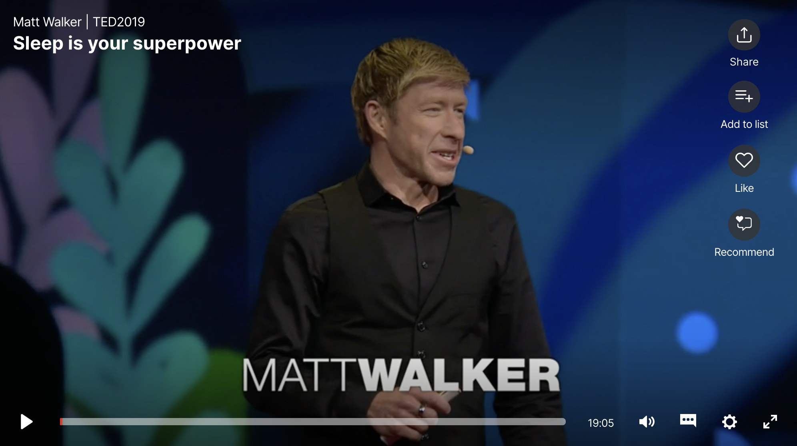

theme: Customiz Zurich, 6

# What On-Call Does to Us

^ Looking at what science can tell us about the impact being of on-call

---

Rich Burroughs
@richburroughs on Twitter

---

# It was 1996

^ The year that Independence Day was relased
^ It was a simpler time
^ Got a call center job at an ISP and got promoted to sysadmin

---

^ My boss got me a pager. I was the only sysadmin, and I was suddenly on-call all of the time for a small number of Linux hosts (5-10)

---

# I was stoked

^ I think I was probably excited about this. Suddenly I had some extra responsibility.

---

# Fast forward to 2016

^ Fast forward 20 years.
^ I worked next as a sysadmin at WebMD, when the company was taking out Super Bowl ads, then at a web hosting company, a payments company, a company with an email maarketing platform, and then finally as an SRE at Puppet
 I'd been on-call for most of that time, in rotations of different sizes. Some as small as 3 people, some as big as 10.
^ For a while I was on a team where our boss divided us up by time slots instead of weeks. I was oncall every evening from 7PM to midnight.

---

# My mental health had deteriorated

^ I started having very bad claustrophobia and had panic attacks when I would board airplanes.
^ The first time I had a debate with myself about asking them to let me off of the plane.
^ I was diagnosed with Generalized Anxiety Disorder. I also had episodes of depression where I'd be in bed for a week straight.

---

# I'm not saying all of this was from being on-call

^ Other things were happening in my life that contributed to my anxiety and depression.
^ But I also can't imagine that being on-call for most of 20 years helped.

---

# We all have on-call stories

^ Talk to anyone who has been on-call and they can likely tell you about pain they've felt from it.
^ We talk about these things a lot. I've heard stories from a lot of my peers as well.
^ But this is all anecdotal. We all have biases and we're unreliable narrators of our own lives.

---

# Meanwhile... Scientists have studied on-call

^ Meanwhile there are psychologists and other scientists who have been studying the effect of being oncall for decades. 
^ Sometimes as people in tech we think we know it all and ignore the work of people in other disciplines.
^ We should learn from them instad.

---

# So let's look at some studies

- Psychological studies are a great way to identify things that are counterintuitive, or areas we are blind to due to our biases
- Individual studies are just one data point
- I'm not a mental health professional

^ I'm going to share with you a few scientific studies about being on-call

---

# Sleep studies

^ Before we get into the oncall studies, let's talk for a moment about sleep studies
^ We all know on-call can cause sleep deprivation

---

^ There was a great Ted talk from 2019 by a sleep scientist named Matt Walker
^ His team did a study where they found people in a sleep deprived group had a 40% learning deficit

---

# Some other things he mentions that can be caused by sleep deprivation

- Heart attacks
- Car crashes
- Immune system deficiency
- Increased risk of cancer

## https://www.ted.com/talks/matt_walker\_sleep\_is\_your\_superpower/footnotes

---

# On-call studies

---

# Things to consider when looking at on-call studies

- Many of the studies look at people in other professions
- Some are focused on people who have to be on site
- Some look at "extended work availability"

---

## First Study: "The Relationship of On-Call Work with Fatigue, Work-Home Interference, and Perceived Performance Difficulties (2015)"

### https://www.ncbi.nlm.nih.gov/pmc/articles/PMC4628979/

---

# Methodology

- Survey of Dutch employees
- Started with 5,347 respondents, final sample was 157
- Subjects ranged from ages 23-69 years and were 71% males
- This focused on off-site on-call

---

# Findings

> "Our results suggest that it is employees' experience of being on-call, especially the experience of stress _due to the unpredictability, rather than the amount of exposure_, that is related to fatigue, WHI, and perceived on-call performance difficulties."

## WHI = work-home interference

^ WHI stands for Work-home interference
^ It's what it sounds like, a negative interaction between those two domains
^ They found the issue is unpredictability, not the amount of exposure, or in our case, incidents

---

# Findings

> "This means that _even a low amount_ of (active) on-call hours a month and _even a low frequency_ of being called to work can be related to an increase in fatigue and work-home interference, when employees experience being on-call negatively."

^ Even a low frequency of interruptions, or incidents in our cases

---

# Detachment

> "Psychological detachment refers to _mentally disengaging_ from work and not thinking about work-related issues. A lack of detachment relates to negative recovery-related outcomes such as _fatigue, work-home interference, and emotional exhaustion_."

---

## Second study: "Extended work availability and its relation with start-of-day mood and cortisol (2016)"

### https://content.apa.org/record/2015-35552-001

---

# Methodology

- 132 people from 13 organizations completed surveys
- Surveys done on 4 days on and 4 days off
- Subset of 51 people provided morning cortisol levels

---

# Findings

> "...significant effects of extended work availability on the daily start-of-day mood and cortisol awakening response."

---

# What is the cortisol awakening response (CAR)?

---

# CAR

> "..an increase between 38% and 75% in cortisol levels peaking 30–45 minutes after awakening in the morning in some people."
-- Wikipedia

^ According to Wikipedia it's "an increase between 38% and 75% in cortisol levels peaking 30–45 minutes after awakening in the morning in some people."

---

# CAR

> The function of CAR is unknown but one hypothesis is "that the cortisol rise after awakening may accompany an activation of prospective memory representations at awakening _enabling individual's orientation about the self in time and space as well as anticipation of demands of the upcoming day_."
-- Wikipedia

^ The purpose is unknown 
^ One hypothesis
^ If that theory is true, think of it like resetting and preparing for the day
^ This is definitely an impact to our bodies that I wouldn't have known about without digging into this.

---

^ If there's anything you didn't understand about this study, just look at this table real quick
^ Some of these studies can be pretty hard to parse if you're not an academic.
^ I'm not. I was a Theatre major in college and dropped out
^ If a study it hard, try looking at secondary sources

---

# Scientific American article

> “Participants marked lower moods the morning after being on-call.... The possibility alone impeded recovery from work, as _the effects persisted even when no calls came_.”

## https://www.scientificamerican.com/article/the-strain-of-always-being-on-call/

^ The effetcs persisted even when no calls came
^ Just like the first study

---

# Scientific American article

> “People who were able to detach from work even while on call were most likely to recoup their energies and avoid effects on mood and cortisol."

^ Mental detachment again

---

## Third Study: "Understanding the Differing Impacts of On-Call Work for Males and Females: Results from an Online Survey (2019)"

### https://www.ncbi.nlm.nih.gov/pmc/articles/PMC6388272/

---

# Methodology

- Online survey of 228 subjects
- Looked at "sex differences" related to on-call (not gender)

^ I'm not crazy about this being binary
^ Focused on sex not gender, although it was an online survey so people likely self identified. It's not clear.

---

# Findings

"Results indicated that female respondents were more likely to be responsible for running their household..."

^ They mention that previous studies show "women spend nearly twice as long as men on childcare and domestic duties"

---

# How much does on-call work interfere with... 

## The sort of things you would like to do in your leisure time (e.g. sport, activities, hobbies)

| | Male | Female |
| --- | --- | --- |
| Not at all/a bit | 22.3% | 13.3% |
| Somewhat | 43.8% | 29.6% |
| A lot/very much | 33.8% | 57.1% |

^ Let's look at a few questions from the study
^ Many more women saying a lot

---

# How much does on-call work interfere with... 

## The domestic things you have to do in your time off work (e.g. domestic tasks, children)

| | Male | Female |
| --- | --- | --- |
| Not at all/a bit | 36.9% | 19.4% |
| Somewhat | 36.2% | 41.8% |
| A lot/very much | 26.9% | 38.8% |

^ Less of an impact than the last question but still more females saying somewhat and a lot

---

# How much does on-call work interfere with... 

## The non-domestic things you have to do in your time off work (e.g. doctor, library, bank)

| | Male | Female |
| --- | --- | --- |
| Not at all/a bit | 50.8% | 27.6% |
| Somewhat | 29.2% | 39.8% |
| A lot/very much | 20.0% | 32.7% |

^ Even less of an impact but it's still impacting females more

---

# I didn't know this 

^ I'm single and have no children
^ It makes sense but I just hadn't considered it a lot

---

# To summarize the studies

- The uncertainty of being on-call is impactful, even if there are no incidents
- Mental detachment can help with recovery
- Being on-call interferes more with some people's lives than others

---

# Improving on-call to reduce the stress of uncertainty

^ We all know oncall is hard, but how can we improve it it?

---

# Improving incident response

- Using incident response tooling for better communication and collaboration
- Improving other tooling like Observability
- Learning from incidents

^ Incident commander training
^ Tools to manage incidents, and related tools like Observability
^ This includes retrospectices. Resilience Engineering folks have a lot to say about this.

---

# On-call training

- Training for incident response roles, like Incident Commander
- Fire drills and tabletop exercises
- Chaos Engineering

^ We're not good at this as an industry
^ You need to know how to perform your role and communicate
^ Fire drills are a good way to practice working together
^ We did tabletop exercises when I was at Puppet
^ With Chaos Engineering you can inject faults into a system and practice how to respond

---

# Changing how we alert

- Make alerts actionable
- Don't alert on 50% CPU
- Alert based on SLOs/Error budgets

---

^ Available for Kindle now, release date is September 15

---

# Empathy

- Having each other's back
- Taking someone's shift if they're having a tough week

^ Checking in

---

# What can we do as individuals?

---

# Coping mechanisms

- Ask for help if you need it
- Look for ways to get mental detachment
- Mindful meditation
- Therapy

^ Detachment
^ You may be a skeptic like me but scientific studies have shown meditation has an impact. Brain scans
^ Many meditation teachers use a meditation focused on  self-compassion - called Loving-Kindess
^ I've been in therapy for a few years
^ Cognitive Behaviour Therapy focuses on the negative beliefs that cause us to be anxious or depressed

---

---

# You have to be your own advocate

^ Something I learned in my career
^ No matter how much you like your team, manager and company, in the end you have to look out for yourself
^ That may mean finding a new team or a new company if you're not able to improve oncall where you are
^ In my case that meant getting out of SRE

---

# Be kind to yourself

^ Exercise from When Panic Attacks where you imagine a friend in the same situation 

---

# Feedback is appreciated

# https://bit.ly/3jmHzm8

^ Thank you all for listening and to the organizers
^ Would love to hear your feedback on the talk
^ It's anonymous and should just take a few minutes
